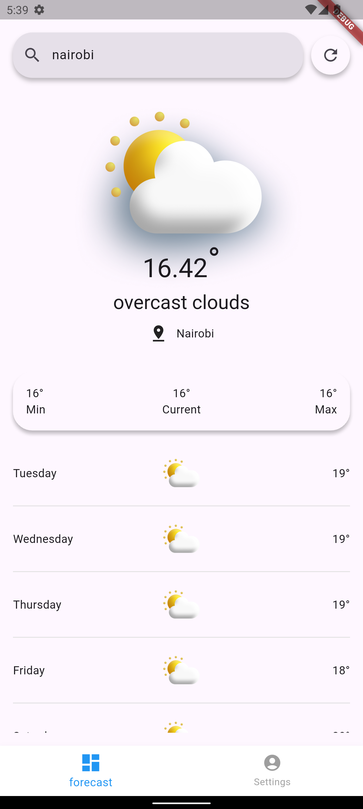
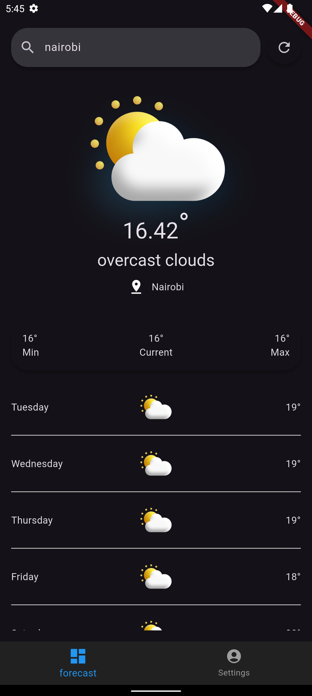

# weather_app

A new Flutter project for weather forecasting.

 


## Project Overview
This project is a weather application built using Flutter, designed to provide users with current weather conditions and forecasts for various cities. The app utilizes both remote and local data sources to ensure a seamless user experience.

## Approach
The application follows a clean architecture pattern, separating concerns into different layers:
- **Data Layer**: Responsible for fetching data from remote APIs and storing it locally using Hive.
- **Domain Layer**: Contains business logic and defines repositories for data access.
- **Presentation Layer**: Manages the UI and user interactions.

## Challenges Faced
1. **Data Synchronization**: Ensuring that the local database is updated whenever new data is fetched from the remote source.
2. **Connectivity Issues**: Handling scenarios where the user may not have internet access and still providing relevant data from the local database.

## Solutions Implemented
- Implemented a `ForecastLocalDataSource` to manage local data storage and retrieval, allowing the app to function offline.
- Added connectivity checks before making remote API calls, falling back to local data if the internet is unavailable.
- Included the ability to switch between metric and imperial units for temperature and distance.
- Implemented language localization to support multiple languages, enhancing accessibility for users.
- Configured the application to support different environments (staging and production) to facilitate testing and deployment.


## Setup and Run the Project
1. Clone the repository:
   ```bash
   git clone https://github.com/BrianMuigai/flutter-weather-app
   ```
2. Navigate to the project directory:
   ```bash
   cd weather_app
   ```
3. Install the dependencies:
   ```bash
   flutter pub get
   ```
4. Run the application:
   ```bash
   flutter run
To generate json-serialized files, run:

```bash
dart run build_runner build
```

or watch for changes and build on save by:

```bash
dart run build_runner watch --delete-conflicting-outputs
```
